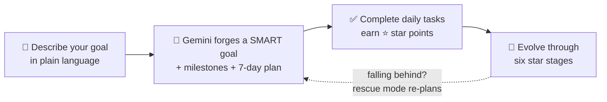

<div align="center">


# GoalForge

### Turn a sentence into a plan. Forge your goals into stars. ✦

**Describe any goal in plain language — GoalForge's AI forges it into a SMART goal with milestones and a 7-day task plan. Finish tasks, earn star points, and watch your star evolve from a Speck into a Celestial.**

<br/>

[](https://goalforge.me/)
&nbsp;
[](https://github.com/Samat-ai/goalforge/actions/workflows/ci.yml)
&nbsp;
[](LICENSE)

<br/>


</div>

<br/>

<div align="center">
  
  <p><sub><i>The dashboard — your active goals, today's tasks, and your evolving star.</i></sub></p>
</div>

<br/>

## ✨ How it works



<div align="center">

**Your star evolves as you earn points:**

`🌑 Speck` → `🔥 Ember` → `☄️ Flare` → `🌟 Luminary` → `💫 Nova` → `✦ Celestial`

</div>

<br/>

## 🚀 Features

| | |
|---|---|
| 🤖 **AI goal breakdown** | Describe a goal in plain language; Gemini 2.5 Flash turns it into a SMART goal with milestones and a 7-day daily task plan. |
| 🌟 **RPG-style progression** | Star points from completed tasks and achieved goals advance you through six evolution stages. |
| 📊 **Adaptive sprints** | Difficulty (lighter / balanced / stretch) tunes itself from your last 14 days of completion history. |
| 🛟 **Rescue mode** | Falling behind surfaces an "Easy Mode" re-plan instead of letting a goal go stale. |
| 💬 **Coach chat** | Solly, a guided AI coach, turns a short conversation into a fully forged goal. |
| 🏅 **Star Log & Analytics** | Collectible rewards, streaks, and progress trends over time. |
| 🔔 **Web push** | Daily digest, streak-saver, and inactivity nudges — installable as a PWA. |

<br/>

## 🧱 Tech Stack

| Layer | Stack |
|---|---|
| **Frontend** | React 19 · TypeScript · Vite · Tailwind CSS v4 · React Query |
| **Backend** | FastAPI (async) · SQLAlchemy 2.0 + asyncpg · PostgreSQL · Alembic |
| **AI** | Google Gemini 2.5 Flash (structured output) |
| **Auth** | Clerk |
| **Infra** | Docker Compose (local) · Cloudflare Pages + Heroku (production) |

<br/>

## ⚡ Quickstart (Docker)

The fastest way to run the full stack locally:

```bash
cp apps/api/.env.example apps/api/.env   # fill in GEMINI_API_KEY and CLERK_* vars
docker compose up --build
```

| Service | URL |
|---|---|
| Frontend | http://localhost:5173 |
| API | http://localhost:8000 |

> [!NOTE]
> Point `DATABASE_URL` at the compose db service:
> `postgresql+asyncpg://postgres:postgres@db:5432/goalforge`.
> Postgres isn't published to the host by default — for direct `psql` access, add a
> `docker-compose.override.yml` with `ports: ["5432:5432"]` on the `db` service.

<br/>

## 🛠️ Manual setup (without Docker)

<details>
<summary><b>Backend</b> — FastAPI + PostgreSQL</summary>

```bash
cd apps/api
pip install -r requirements.txt
cp .env.example .env        # fill in DATABASE_URL, GEMINI_API_KEY, CLERK_* vars
alembic upgrade head
uvicorn main:app --reload --port 8000
```

</details>

<details>
<summary><b>Frontend</b> — React + Vite</summary>

```bash
cd apps/web
npm install
# create apps/web/.env.local with VITE_CLERK_PUBLISHABLE_KEY=pk_...
npm run dev                 # → http://localhost:5173
```

</details>

<br/>

## 📚 Docs

| Doc | What's inside |
|---|---|
| [`docs/CONVENTIONS.md`](docs/CONVENTIONS.md) | Coding conventions & file-structure rules — each backed by the incident that motivated it. |
| [`docs/DEPLOYMENT.md`](docs/DEPLOYMENT.md) | Production topology (Heroku + Cloudflare Pages) and deploy runbook. |

<br/>

## 🤝 Contributing

1. Fork the repo and branch off `main` as `feature/<short-description>`.
2. Use [Conventional Commits](https://www.conventionalcommits.org/) (`feat:`, `fix:`, `chore:`).
3. Open a PR — CI and an automated Claude code review run on every pull request.

<br/>

## 📄 License

MIT © Kerimkulov Samat — see [`LICENSE`](LICENSE).

<br/>

<div align="center">
  <sub>Built with ✦ by <a href="https://github.com/Samat-ai">Samat</a> — if GoalForge sparks something, drop a ⭐</sub>
</div>
